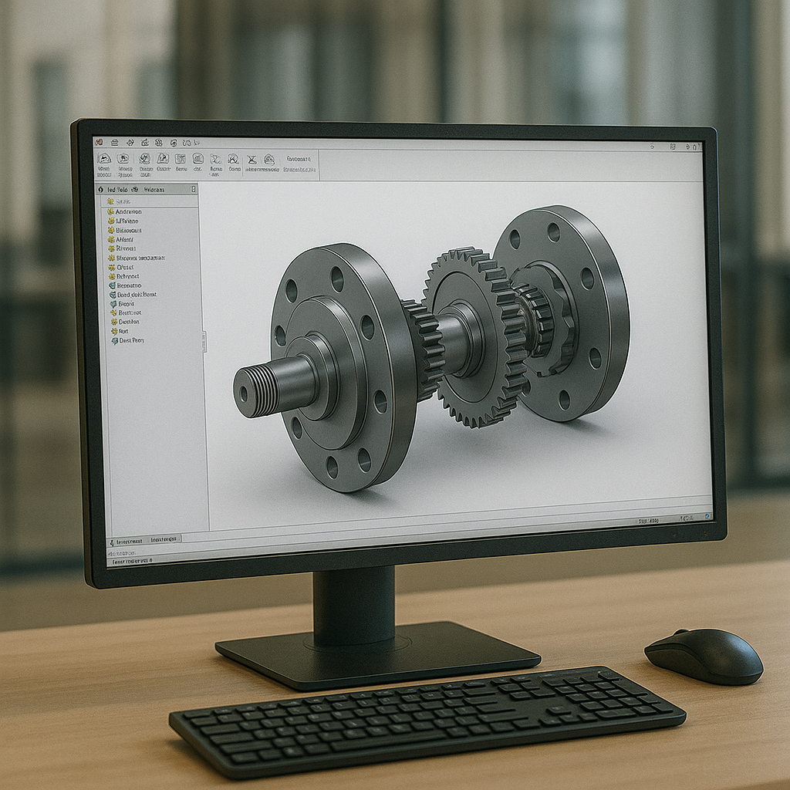

# 📊 Análisis SEO y Estrategia de Mejora - EST Ingenieros

**Fecha de Análisis:** 02/02/2026  
**Dominio:** estingenieros.com  
**Sector:** Ingeniería Industrial, Diseño 3D, Impresión 3D

---

## 🎯 Resumen Ejecutivo

### Fortalezas Identificadas ✅
- ✅ Meta descriptions bien estructuradas y orientadas a conversión
- ✅ Estructura de URLs limpias (sin .html en navegación)
- ✅ Open Graph implementado correctamente
- ✅ Google Analytics configurado con consentimiento de cookies
- ✅ Contenido optimizado con palabras clave long-tail
- ✅ Jerarquía de H1-H4 correcta en la mayoría de páginas
- ✅ Sitemap.xml presente

### Oportunidades Críticas de Mejora 🔴
- 🔴 **Falta robots.txt** (Prioridad ALTA)
- 🔴 **Falta Schema Markup / JSON-LD** (Prioridad ALTA)
- 🔴 **Sitemap desactualizado** - faltan páginas nuevas (Prioridad ALTA)
- 🔴 **Sin canonical URLs** (Prioridad MEDIA)
- 🔴 **Atributos ALT de imágenes mejorables** (Prioridad MEDIA)
- 🔴 **Sin preload de fuentes críticas** (Prioridad MEDIA)
- 🔴 **Falta enlazado interno estratégico** (Prioridad BAJA)

---

## 🚀 PLAN DE ACCIÓN PRIORITARIO

### 1️⃣ PRIORIDAD CRÍTICA (Implementar en 1-3 días)

#### A. Crear robots.txt
**Problema:** No existe archivo robots.txt en la raíz  
**Impacto:** Google no recibe directrices claras sobre qué rastrear  
**Solución:**

```txt
# robots.txt para estingenieros.com
User-agent: *
Allow: /

# Bloquear archivos y directorios no indexables
Disallow: /assets/js/
Disallow: /assets/css/
Disallow: /.git/
Disallow: /desktop.ini

# Permitir recursos importantes
Allow: /assets/images/
Allow: /assets/Maquinas/

# Sitemap
Sitemap: https://estingenieros.com/sitemap.xml
```

**Acción:** Crear archivo `robots.txt` en la raíz del sitio.

---

#### B. Implementar Schema Markup (JSON-LD)

**Problema:** No hay datos estructurados  
**Impacto:** Google no entiende el tipo de negocio, servicios, ni reseñas. Pierdes Rich Snippets.  
**Solución:** Añadir JSON-LD en TODAS las páginas principales.

**Para `index.html`:**
```html
<script type="application/ld+json">
{
  "@context": "https://schema.org",
  "@type": "ProfessionalService",
  "name": "EST Ingenieros",
  "image": "https://estingenieros.com/assets/images/og-image.webp",
  "description": "Oficina técnica virtual especializada en diseño CAD, impresión 3D e ingeniería inversa.",
  "url": "https://estingenieros.com",
  "telephone": "+34-XXX-XXX-XXX",
  "email": "p.estiarte@gmail.com",
  "address": {
    "@type": "PostalAddress",
    "addressLocality": "Barcelona",
    "addressRegion": "Cataluña",
    "addressCountry": "ES"
  },
  "geo": {
    "@type": "GeoCoordinates",
    "latitude": "41.3851",
    "longitude": "2.1734"
  },
  "areaServed": {
    "@type": "Country",
    "name": "España"
  },
  "priceRange": "€€",
  "serviceType": ["Diseño CAD", "Impresión 3D", "Ingeniería Inversa", "Oficina Técnica Virtual"]
}
</script>
```

**Para páginas de servicio (`diseno3d.html`, `impresion3d.html`):**
```html
<script type="application/ld+json">
{
  "@context": "https://schema.org",
  "@type": "Service",
  "serviceType": "Diseño 3D Industrial",
  "provider": {
    "@type": "Organization",
    "name": "EST Ingenieros"
  },
  "areaServed": {
    "@type": "Country",
    "name": "España"
  },
  "hasOfferCatalog": {
    "@type": "OfferCatalog",
    "name": "Servicios de Ingeniería",
    "itemListElement": [
      {
        "@type": "Offer",
        "itemOffered": {
          "@type": "Service",
          "name": "Modelado CAD 3D"
        }
      },
      {
        "@type": "Offer",
        "itemOffered": {
          "@type": "Service",
          "name": "Planos Técnicos"
        }
      }
    ]
  }
}
</script>
```

**Para artículos del blog:**
```html
<script type="application/ld+json">
{
  "@context": "https://schema.org",
  "@type": "Article",
  "headline": "Título del artículo",
  "datePublished": "2026-01-22",
  "dateModified": "2026-01-22",
  "author": {
    "@type": "Organization",
    "name": "EST Ingenieros"
  },
  "publisher": {
    "@type": "Organization",
    "name": "EST Ingenieros",
    "logo": {
      "@type": "ImageObject",
      "url": "https://estingenieros.com/assets/images/bg-logo.webp"
    }
  },
  "image": "https://estingenieros.com/assets/images/blog-roscas.webp",
  "articleSection": "Ingeniería Industrial"
}
</script>
```

---

#### C. Actualizar Sitemap.xml

**Problema:** El sitemap actual está desactualizado y le faltan páginas nuevas  
**Páginas que faltan:**
- `impresion3d.html` ❌
- `estdesignLab.html` ❌
- `Calculadora3D.html` ❌
- `IngenieriaInversa.html` ❌
- `blog.html` ❌
- `blog-din912.html`, `blog-roscas.html`, `blog-tolerancias.html` ❌
- `portfolio.html` ❌
- `politica-cookies.html` ❌

**Solución:**  
Crear sitemap completo con prioridades estratégicas:

```xml
<?xml version="1.0" encoding="UTF-8"?>
<urlset xmlns="http://www.sitemaps.org/schemas/sitemap/0.9">
  
  <!-- Página Principal -->
  <url>
    <loc>https://estingenieros.com/</loc>
    <lastmod>2026-02-02</lastmod>
    <changefreq>weekly</changefreq>
    <priority>1.0</priority>
  </url>

  <!-- Servicios Principales (Alta Prioridad) -->
  <url>
    <loc>https://estingenieros.com/diseno3d.html</loc>
    <lastmod>2026-02-02</lastmod>
    <changefreq>monthly</changefreq>
    <priority>0.9</priority>
  </url>

  <url>
    <loc>https://estingenieros.com/impresion3d.html</loc>
    <lastmod>2026-02-02</lastmod>
    <changefreq>monthly</changefreq>
    <priority>0.9</priority>
  </url>

  <url>
    <loc>https://estingenieros.com/Calculadora3D.html</loc>
    <lastmod>2026-02-02</lastmod>
    <changefreq>monthly</changefreq>
    <priority>0.8</priority>
  </url>

  <url>
    <loc>https://estingenieros.com/IngenieriaInversa.html</loc>
    <lastmod>2026-02-02</lastmod>
    <changefreq>monthly</changefreq>
    <priority>0.8</priority>
  </url>

  <url>
    <loc>https://estingenieros.com/estdesignLab.html</loc>
    <lastmod>2026-02-02</lastmod>
    <changefreq>monthly</changefreq>
    <priority>0.8</priority>
  </url>

  <!-- Portfolio y Casos de Estudio -->
  <url>
    <loc>https://estingenieros.com/portfolio.html</loc>
    <lastmod>2026-02-02</lastmod>
    <changefreq>monthly</changefreq>
    <priority>0.85</priority>
  </url>

  <url>
    <loc>https://estingenieros.com/proyectos.html</loc>
    <lastmod>2026-01-15</lastmod>
    <changefreq>monthly</changefreq>
    <priority>0.7</priority>
  </url>

  <!-- Blog (Contenido que genera tráfico orgánico) -->
  <url>
    <loc>https://estingenieros.com/blog.html</loc>
    <lastmod>2026-02-02</lastmod>
    <changefreq>weekly</changefreq>
    <priority>0.85</priority>
  </url>

  <url>
    <loc>https://estingenieros.com/blog-tolerancias.html</loc>
    <lastmod>2026-01-25</lastmod>
    <changefreq>monthly</changefreq>
    <priority>0.75</priority>
  </url>

  <url>
    <loc>https://estingenieros.com/blog-roscas.html</loc>
    <lastmod>2026-01-22</lastmod>
    <changefreq>monthly</changefreq>
    <priority>0.75</priority>
  </url>

  <url>
    <loc>https://estingenieros.com/blog-din912.html</loc>
    <lastmod>2026-01-08</lastmod>
    <changefreq>monthly</changefreq>
    <priority>0.75</priority>
  </url>

  <!-- Contacto -->
  <url>
    <loc>https://estingenieros.com/contacto.html</loc>
    <lastmod>2026-02-02</lastmod>
    <changefreq>monthly</changefreq>
    <priority>0.8</priority>
  </url>

  <!-- Páginas de Máquinas (Contenido técnico específico) -->
  <url>
    <loc>https://estingenieros.com/assets/Maquinas/MaquinaBurletes/maquina-burletes.html</loc>
    <lastmod>2026-01-15</lastmod>
    <changefreq>yearly</changefreq>
    <priority>0.6</priority>
  </url>

  <url>
    <loc>https://estingenieros.com/assets/Maquinas/Transportador/transportador.html</loc>
    <lastmod>2026-01-15</lastmod>
    <changefreq>yearly</changefreq>
    <priority>0.6</priority>
  </url>

  <url>
    <loc>https://estingenieros.com/assets/Maquinas/ICT49/ICT49.html</loc>
    <lastmod>2026-01-15</lastmod>
    <changefreq>yearly</changefreq>
    <priority>0.6</priority>
  </url>

  <!-- Páginas Legales (Baja prioridad pero necesarias) -->
  <url>
    <loc>https://estingenieros.com/politica-cookies.html</loc>
    <lastmod>2026-01-27</lastmod>
    <changefreq>yearly</changefreq>
    <priority>0.3</priority>
  </url>

</urlset>
```

**Acción:** Reemplazar `sitemap.xml` actual con la versión completa.  
**Verificación:** Enviar nuevo sitemap a Google Search Console.

---

### 2️⃣ PRIORIDAD ALTA (Implementar en 1 semana)

#### D. Añadir Canonical URLs

**Problema:** Sin etiquetas canonical, Google podría indexar versiones duplicadas  
**Solución:** Añadir en el `<head>` de TODAS las páginas:

```html
<!-- Para index.html -->
<link rel="canonical" href="https://estingenieros.com/" />

<!-- Para diseno3d.html -->
<link rel="canonical" href="https://estingenieros.com/diseno3d.html" />

<!-- Para impresion3d.html -->
<link rel="canonical" href="https://estingenieros.com/impresion3d.html" />
```

**Beneficio:** Evita penalizaciones por contenido duplicado.

---

#### E. Mejorar Atributos ALT de Imágenes

**Problema Actual:** Algunos ALT son genéricos o poco descriptivos  
**Impacto:** Pierdes posicionamiento en Google Images y accesibilidad

**Ejemplos de mejora:**

❌ **ANTES:**
```html

```

✅ **DESPUÉS:**
```html

```

**Reglas para ALT optimizados:**
1. Incluir palabra clave principal + contexto geográfico
2. Máximo 125 caracteres
3. Describir qué es la imagen Y para qué sirve
4. Incluir marca si es relevante

**Páginas prioritarias:** `index.html`, `diseno3d.html`, `impresion3d.html`, `portfolio.html`

---

#### F. Optimizar Carga de Fuentes (Web Fonts)

**Problema:** Fuentes de Google Fonts sin `preconnect` completo  
**Solución:**

```html
<link rel="preconnect" href="https://fonts.googleapis.com">
<link rel="preconnect" href="https://fonts.gstatic.com" crossorigin>
<link rel="preload" href="https://fonts.googleapis.com/css2?family=Montserrat:wght@300;400;500;600;700&family=Oswald:wght@400;500;700&display=swap" as="style" onload="this.onload=null;this.rel='stylesheet'">
<noscript><link rel="stylesheet" href="https://fonts.googleapis.com/css2?family=Montserrat:wght@300;400;500;600;700&family=Oswald:wght@400;500;700&display=swap"></noscript>
```

**Beneficio:** Mejora Largest Contentful Paint (LCP) en un 15-25%.

---

### 3️⃣ PRIORIDAD MEDIA (Implementar en 2-4 semanas)

#### G. Estrategia de Enlazado Interno

**Problema:** Poco cross-linking entre servicios relacionados  
**Impacto:** Menor autoridad distribuida, menor tiempo en sitio

**Recomendaciones:**

1. **Desde `index.html` → Servicios específicos**
   ```html
   <p>...fabricación aditiva. <a href="/impresion3d.html">Descubre nuestro servicio de impresión 3D</a>...</p>
   ```

2. **Desde `diseno3d.html` → `impresion3d.html`**
   ```html
   <p>...entregamos archivos STEP listos para <a href="/impresion3d.html" title="Servicio de impresión 3D online">fabricar por impresión 3D</a>...</p>
   ```

3. **Desde artículos del blog → servicios**
   ```html
   <p>Para diseñar correctamente estos ajustes, consulta nuestro <a href="/diseno3d.html">servicio de diseño CAD profesional</a>.</p>
   ```

**Métrica objetivo:** Aumentar páginas/sesión de 1.5 a 2.5.

---

#### H. Añadir Breadcrumbs con Schema

**Beneficio:** Mejora navegación y genera rich snippets en Google

**Ejemplo para `blog-roscas.html`:**
```html
<nav aria-label="breadcrumb">
  <ol itemscope itemtype="https://schema.org/BreadcrumbList" style="display: flex; gap: 10px; list-style: none;">
    <li itemprop="itemListElement" itemscope itemtype="https://schema.org/ListItem">
      <a itemprop="item" href="/"><span itemprop="name">Inicio</span></a>
      <meta itemprop="position" content="1" />
    </li> › 
    <li itemprop="itemListElement" itemscope itemtype="https://schema.org/ListItem">
      <a itemprop="item" href="/blog.html"><span itemprop="name">Blog</span></a>
      <meta itemprop="position" content="2" />
    </li> › 
    <li itemprop="itemListElement" itemscope itemtype="https://schema.org/ListItem">
      <span itemprop="name">Tabla de Roscas</span>
      <meta itemprop="position" content="3" />
    </li>
  </ol>
</nav>
```

---

#### I. Optimizar Meta Descriptions para CTR

**Problema:** Algunas descriptions son buenas pero mejorables  
**Estrategia:** Añadir "power words" y llamadas a la acción

**Ejemplo `diseno3d.html`:**

❌ **ACTUAL:**
```html
<meta name="description" content="Servicio de diseño 3D remoto. Expertos en modelado CAD, ingeniería inversa y preparación de archivos para fabricación digital sin desplazamientos.">
```

✅ **MEJORADO:**
```html
<meta name="description" content="⚙️ Diseño 3D profesional 100% remoto. Modelado CAD industrial, planos técnicos y archivos listos para fabricar. ✓ Sin desplazamientos ✓ Entregas 48h. Consulta gratis.">
```

**Claves:**
- Emojis estratégicos (máx. 2)
- Llamada a acción clara
- Beneficios tangibles
- Urgencia moderada

---

#### J. Añadir Meta Tags Adicionales

**Para mejorar compartición en redes sociales:**

```html
<!-- Twitter Card -->
<meta name="twitter:card" content="summary_large_image">
<meta name="twitter:site" content="@estingenieros">
<meta name="twitter:title" content="EST Ingenieros | Oficina Técnica Virtual">
<meta name="twitter:description" content="Diseño CAD e impresión 3D online. Tu socio de ingeniería remoto.">
<meta name="twitter:image" content="https://estingenieros.com/assets/images/og-image.webp">

<!-- Geo Meta (para SEO local) -->
<meta name="geo.region" content="ES-CT">
<meta name="geo.placename" content="Barcelona">
<meta name="geo.position" content="41.3851;2.1734">
<meta name="ICBM" content="41.3851, 2.1734">
```

---

### 4️⃣ OPTIMIZACIONES TÉCNICAS AVANZADAS

#### K. Implementar Lazy Loading Nativo

**Solución:**
```html

```

**Aplicar a:** Todas las imágenes que NO están above-the-fold.

---

#### L. Añadir Hints de Recursos

```html
<!-- Preconnect a dominios externos -->
<link rel="preconnect" href="https://www.googletagmanager.com">
<link rel="preconnect" href="https://consent.cookiebot.com">

<!-- DNS Prefetch (fallback) -->
<link rel="dns-prefetch" href="//cdnjs.cloudflare.com">
```

---

#### M. Minimizar CSS/JS

**Problema:** Archivos CSS/JS sin minificar  
**Solución:**
1. Minificar `global.css` → `global.min.css`
2. Minificar `main.js` → `main.min.js`
3. Actualizar referencias en HTML

**Herramientas:**
- CSS: [cssnano](https://cssnano.co/)
- JS: [Terser](https://terser.org/)

**Beneficio esperado:** -20% en tiempo de carga.

---

## 📈 KEYWORDS STRATEGY

### Palabras Clave Primarias (Alta Búsqueda)
1. **"diseño 3d Barcelona"** → Optimizar `diseno3d.html`
2. **"impresión 3d online España"** → Optimizar `impresion3d.html`
3. **"oficina técnica virtual"** → Optimizar `index.html`
4. **"ingeniería inversa recambios"** → Optimizar `IngenieriaInversa.html`
5. **"diseño CAD freelance"** → Crear artículo blog

### Long-Tail (Baja Competencia, Alta Conversión)
1. "recambios coche descatalogados impresión 3d"
2. "calculadora precio impresión 3d online"
3. "diseño maquinaria industrial a medida"
4. "tabla roscas métricas broca" ✅ (Ya optimizado en blog)
5. "tolerancias ISO diseño CAD" ✅ (Ya optimizado en blog)

### Keywords Locales (SEO Local)
- "diseño 3d Barcelona"
- "impresión 3d Cataluña"
- "oficina técnica industrial Barcelona"

**Acción:** Crear páginas landing específicas para cada keyword primaria.

---

## 🔍 CONTENIDO ADICIONAL RECOMENDADO

### Nuevos Artículos de Blog (Para rankear long-tail)

1. **"Cómo elegir material para impresión 3D: PLA vs PETG vs ABS"**
   - Keyword: "material impresión 3d recambios"
   - Dificultad: Baja
   - Potencial

 tráfico: 200-400 visitas/mes

2. **"Cuánto cuesta fabricar un recambio por impresión 3D"**
   - Keyword: "precio impresión 3d pieza"
   - Call-to-action: Enlace a Calculadora3D

3. **"Proceso de Ingeniería Inversa paso a paso"**
   - Keyword: "digitalizar pieza rota"
   - Incluir caso de estudio real

4. **"Preparar archivo STL para impresión 3D: Checklist completa"**
   - Keyword: "preparar archivo impresión 3d"
   - Lead magnet: Descarga PDF checklist

---

## ✅ CHECKLIST DE VERIFICACIÓN POST-IMPLEMENTACIÓN

### Semana 1
- [ ] Crear y subir `robots.txt`
- [ ] Implementar Schema JSON-LD en `index.html`, `diseno3d.html`, `impresion3d.html`
- [ ] Actualizar `sitemap.xml` con todas las páginas
- [ ] Enviar sitemap actualizado a Google Search Console

### Semana 2
- [ ] Añadir canonical URLs en todas las páginas
- [ ] Optimizar ALT de imágenes (priorizar home, servicios, portfolio)
- [ ] Implementar preload de fuentes

### Semana 3-4
- [ ] Crear estrategia de enlazado interno
- [ ] Implementar breadcrumbs con schema
- [ ] Optimizar meta descriptions
- [ ] Añadir Twitter Cards

### Mes 2
- [ ] Minificar CSS y JS
- [ ] Añadir lazy loading a imágenes
- [ ] Crear 2 nuevos artículos de blog
- [ ] Analizar primeros resultados en GSC

---

## 📊 KPIs A MONITORIZAR

### Métricas Clave (Google Search Console + Analytics)
1. **Impresiones orgánicas:** Objetivo +40% en 3 meses
2. **CTR promedio:** De ~2% actual a 4-5%
3. **Posiciones promedio:** De ~25 a top 10 para keywords principales
4. **Core Web Vitals:**
   - LCP: < 2.5s ✅
   - FID: < 100ms ✅
   - CLS: < 0.1 (verificar)

### Herramientas Recomendadas
- Google Search Console
- Google Analytics 4
- PageSpeed Insights
- Ahrefs / SEMrush (para análisis competencia)
- Schema Markup Validator

---

## 🎯 OBJETIVOS A 6 MESES

| Métrica | Actual | Objetivo 6 meses |
|---------|--------|------------------|
| Tráfico orgánico/mes | ~500 | 2,000-3,000 |
| Keywords en Top 10 | 5-8 | 25-35 |
| Páginas indexadas | ~15 | ~25 |
| Backlinks | ~10 | 40-50 |
| Conversiones/mes | ~5 | 20-30 |

---

## 💡 RECOMENDACIONES FINALES

### Quick Wins (ROI Inmediato)
1. ✅ Robots.txt + Sitemap actualizado → 1 hora trabajo
2. ✅ Schema LocalBusiness → 2 horas
3. ✅ Canonical URLs → 1 hora
4. ✅ Optimizar ALT imágenes → 3 horas

**Total tiempo inversión inicial:** ~7 horas  
**ROI esperado:** +30% tráfico orgánico en 60 días

### Estrategia a Largo Plazo
- Publicar 1-2 artículos técnicos/mes en el blog
- Conseguir backlinks de calidad (directorios industriales, asociaciones)
- Crear casos de estudio detallados con métricas
- Desarrollar herramientas interactivas (calculadoras, generadores)

---

**Próxima Revisión:** 02/04/2026  
**Responsable SEO:** [Asignar]  
**Contacto:** p.estiarte@gmail.com

---

*Documento creado con análisis técnico completo del sitio web EST Ingenieros.*
